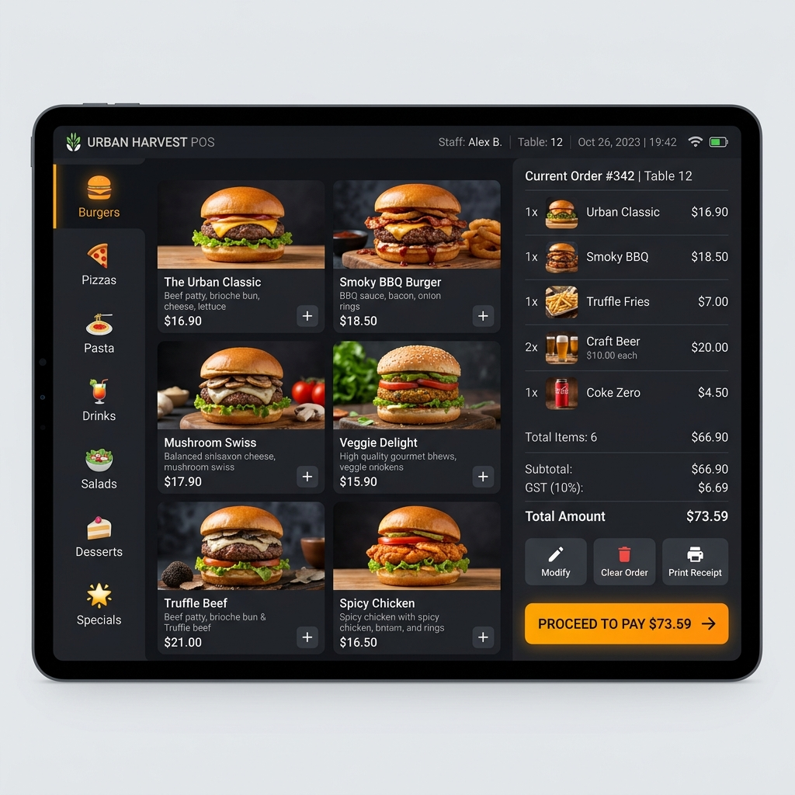
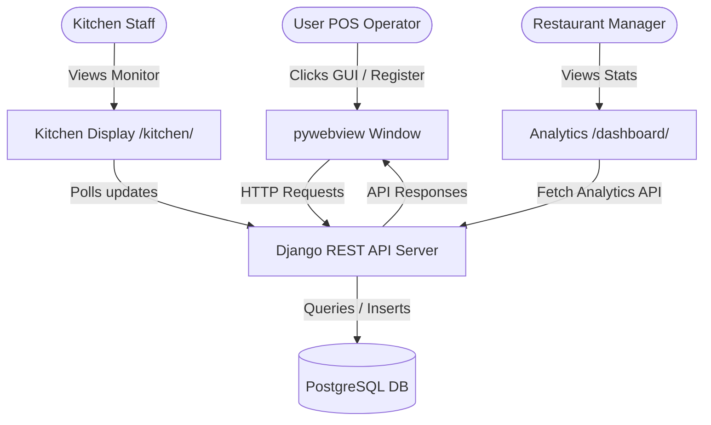

# 🍔 FoodHeaven - Restaurant POS (Point of Sale) System

[](https://www.python.org/)
[](https://www.djangoproject.com/)
[](https://www.postgresql.org/)
[](https://developer.mozilla.org/)
[](#)

A modern, **dark-themed, tablet-friendly Point of Sale (POS) system** designed specifically for restaurants. It operates as a native **desktop application** using Python's `pywebview` module wrapping a robust Django REST Framework backend with a PostgreSQL database.

<p align="center">
  
</p>

---

## ✨ Features

*   **🖥️ Desktop App wrapper:** Runs seamlessly in a dedicated desktop window without browser clutter.
*   **🛒 POS Register Interface:**
    *   Filter items instantly by category (Burgers, Pizzas, Pasta, Drinks, Desserts).
    *   Interactive cart listing with real-time totals, GST (16%) calculation, and dynamic quantity controls (`+` / `-`).
    *   Support for table numbers and multiple checkout modes (Cash / Card) with instant change calculator.
*   **🍳 Kitchen Monitor Display:**
    *   Real-time order tracking status (`Pending` ➡️ `Preparing` ➡️ `Ready`).
    *   One-click update action to transition orders.
    *   Auto-refreshes every 10 seconds to keep kitchen staff synchronized.
*   **📊 Analytics Dashboard:**
    *   Interactive charts (using **Chart.js**) displaying 7-day sales trends.
    *   Instant summaries of today's total sales and completed orders.
    *   Highlights the top 5 best-selling menu items.
*   **📄 Printable Invoices:**
    *   Generate clean, transaction-ready print receipts containing full item breakdowns, tax details, and transaction timestamps.

---

## 🛠️ Tech Stack

| Layer | Technology | Purpose |
| :--- | :--- | :--- |
| **GUI Shell** | `pywebview` | Renders the web app inside a native Chromium/WebView2 window |
| **Backend** | `Django 4.2` + `Django REST Framework` | Handles database models, business logic, and API endpoints |
| **Database** | `PostgreSQL` | Secure and relational persistence for menus, orders, and payments |
| **Frontend** | `HTML5`, `CSS3 (Vanilla)`, `JavaScript (ES6+)` | Responsive, interactive, dark-themed UI |
| **Charts** | `Chart.js` | Visual analytics graphs and trend reporting |

---

## 📂 Project Structure

```bash
Restaurant POS System/
│
├── core/                  # Django project root configuration settings
├── dashboard/             # Front-end views, analytics, and kitchen monitor pages
├── menu/                  # Menu items and category management (models, APIs, fixtures)
├── orders/                # Cart actions, table tracking, and orders (models, APIs)
├── payments/              # Checkout handling and invoice generators
├── templates/             # HTML templates for the Web and Desktop wrappers
├── static/                # CSS, Custom Javascript, and Asset files
│
├── run_desktop.py         # Main entry point to launch the native Desktop Application
├── manage.py              # Django management script
└── requirements.txt       # Python dependencies configuration
```

---

## 🚀 Getting Started

Follow these instructions to configure and run the POS system locally on your Windows machine:

### 1️⃣ Database Setup
Ensure **PostgreSQL** is running on port `5432` with username `postgres` and password `123456`. Create a database named `restaurant_pos`:
```sql
CREATE DATABASE restaurant_pos;
```
> 💡 *Note: The `.env` file is pre-configured to automatically connect to this database.*

### 2️⃣ Install Dependencies
Clone the repository, create a virtual environment, and install dependencies:
```powershell
# Create virtual environment
python -m venv .venv

# Activate virtual environment
.venv\Scripts\Activate.ps1

# Install requirements
pip install -r requirements.txt
```

### 3️⃣ Setup Database Schema & Demo Data
Run migrations and load the mock restaurant dataset (20 menu items, categories, and tables):
```powershell
# Run migrations
python manage.py migrate

# Load demo datasets
python manage.py loaddata menu/fixtures/demo_data.json
python manage.py loaddata orders/fixtures/demo_data.json
```

### 4️⃣ Run the Desktop Application
Launch the system inside its native OS window shell:
```powershell
python run_desktop.py
```
> 🖥️ *Note: This command starts the Django server in a background thread and pops open a custom 1280x800 desktop frame.*

---

## 🔗 Interactive Details

<details>
<summary><b>🔍 System Architecture & Data Flow (Click to expand)</b></summary>


</details>

<details>
<summary><b>🌐 API Endpoints (Click to expand)</b></summary>

Here are some of the primary REST API endpoints exposed by the backend:

| Method | Endpoint | Description |
| :--- | :--- | :--- |
| **GET** | `/api/categories/` | Fetch all menu categories |
| **GET** | `/api/items/` | List menu items (filterable by category) |
| **POST** | `/api/orders/create/` | Create a new active order |
| **PATCH** | `/api/orders/<id>/update-status/` | Update order status (Pending/Preparing/Ready) |
| **POST** | `/api/payments/checkout/` | Process cash/card payment and finalize order |
| **GET** | `/api/dashboard/stats/` | Fetch sales totals and charts datasets |
</details>

<details>
<summary><b>🔑 Access Credentials (Click to expand)</b></summary>

For local testing via standard browsers or direct admin control:
*   **Web Portal & Admin:** [http://127.0.0.1:8000/admin/](http://127.0.0.1:8000/admin/)
*   **Username:** `admin`
*   **Password:** `password123`
</details>

---

## 📄 License
This project is licensed under the MIT License. See the LICENSE file for details.
